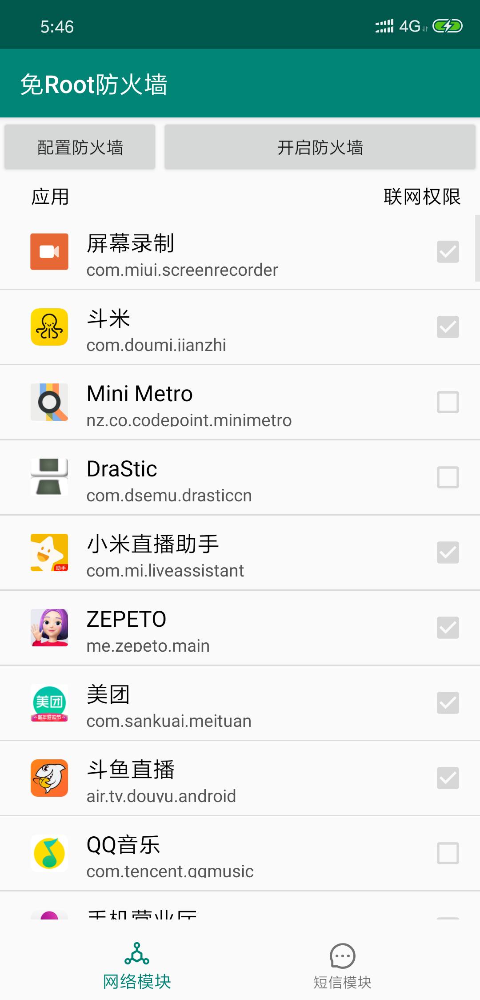
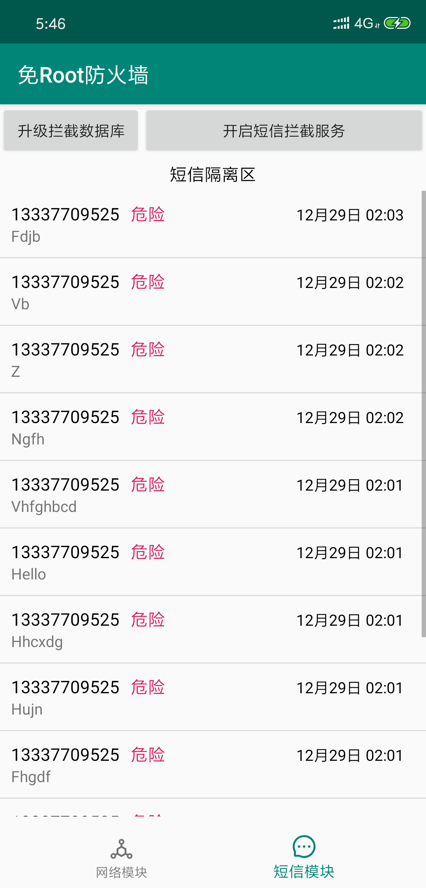

# 🔍RootFreeFireWall
`Android`免免免免免免免`root`防火墙，可以监控、拦截应用流量，还能拦截垃圾短信

---

# 💥原理
## 应用流量拦截
想要实现`Android`系统上的防火墙，一般有两种思路：
* `root`之后使用一些`linux`内核级别的库函数实现包拦截、过滤等
* 免`root`情况下使用`VpnService`可以获取物理网卡要发出去的包，进而实现包拦截、过滤

在`Android`系统中，应用往往都是使用`http`协议进行数据的收发，另外，在`Android`系统中，往往也不用考虑入站数据，因为系统中不可能部署一个服务器应用。由于这样的特殊性，`Android`系统中往往不会针对套接字单元设置防火墙规则，而是简单地设置应用级别的防火墙规则。

这里说一下`VpnService`的原理，`VpnService`是一个`Android`后期版本提供的`API`，他是一个继承于`Service`的服务，当用户实现一个继承自`VpnService`的服务类时，可以建立`Vpn`连接，也就是系统设置中的`VPN`一栏里的设置。

当建立`Vpn`连接之后，可以获取到一个物理网卡的文件描述符，我们可以使用这个文件描述符建立`IO`通道，每一次对这个通道调用`read()`，可以获取到一个本来将要从物理网卡发送到外部网络的`IP`数据包，每一次对这个通道调用`write()`，可以写入一个本来将要从外部网络写入物理网卡的数据包。这一操作是由`VpnService`虚拟出来一张虚拟网卡实现的，整体来看就是这样一张图：

```
    phy     ->    tun0   ->    network
   物理网卡  <-   虚拟网卡  <-    外部网络
```

实际上，我们拿到数据包之后，要把数据包拆了，然后重新封装，再以`tun0`的身份发送给`network`，然后收到`network`回应的包之后，也要拆了，然后重新封装，假装包是直接从`network`发给`phy`的，最后再把那个包写回`phy`。这就是整个流程，`IP`包是无连接的，但是考虑到上层有一些协议是面向连接的，比如`TCP`，我们在`tun0`与`network`之间的通信，还要手动实现三次握手、四次挥手、连接管理等。这就相当于要实现一个简化版的`TCP/IP`技术栈。

最后的效果就是`phy`和`network`相互以为自己再与对方通信，但实际上是`phy`与`tun0`通信、`network`也与`tun0`通信。这样一种思想往往用于搭建`Vpn`，但是，我们只要在`phy`到`tun0`的链路上做手脚，就能断开他与外部的连接，另外，如果在整条通信链路上予以日志记录，就能实现监控的目的。这就是应用流量拦截的思想。

## 垃圾短信拦截
在`Android 4.4`以前，每收到一条短信，系统都会发出一个`SMS_RECEIVED`广播，只要声明了权限，任何应用都能够注册广播接收器来接受这个广播，并且所有应用根据其定义的优先级进行传递式广播。最可怕的是，`SMS_RECEIVED`这一广播，并不只是只读的，优先级比较高的应用，可以篡改短信内容、阻止短信广播继续传播。

这样如果用户没有注意就把权限给予给这类应用，那么这些应用可能潜伏在用户的应用列表里面，影响正常短信应用的工作。

后来`Android`考虑到安全问题，在`Android 4.4`以后引入了一个`默认短信应用`的概念，原来的`SMS_RECEIVED`广播也被拆分成了两部分：
* `SMS_DELIVER`： 短信送达时的广播
* `SMS_RECEIVED`： 短信`content URI`中对应内容发生变化时收到的广播

这样一来，只有唯一的默认短信应用能够获取到`SMS_DELIVER`广播，它对短信仍然是可读可写的，并且它还需要负责将收到的短信拆包，根据格式填入短信的`content URI`中，当正常填入收件箱`URI`中时，就会触发`SMS_RECEIVED`广播，其他的应用可以像以前一样注册广播接收器接收这个广播，这时候短信对普通应用，就是只读的了。

所以要拦截垃圾短信，需要将我们的应用暂时注册为默认短信应用，关闭防火墙之后再还原。

另外，我们是怎么判断一个应用是不是垃圾短信的呢？我们采用了很多厂商采用的信任评价机制，当然，我们是非常简易的版本，就是设置一个中央信任签发架构(可以是一个服务器应用)，开始默认所有的手机号信用程度都比较高，但是一旦手机号遭到他人举报，手机号的被信任度就会被降低。一旦低于某个程度，则认为这个手机号不再是值得信任的了，这时候来自该手机号的任何短信都会被拦截下来。

这一想法需要一个服务器的实现，我们实现了一个简易的版本，仓库在这里，后面也会说到如何部署：[github-FlyAndNotDown-RffSmsInterceptorBackend](https://github.com/FlyAndNotDown/rff-sms-interceptor-backend)以及配合这个项目使用

# 💻编译/发行版
## 自己编译`Debug`版
你只需要安装`Android Studio`，然后克隆我的项目，将其导入`Android Studio`，然后`build`即可在你手机或者你的虚拟机上看到效果，建议使用`Android 7.0`及以上版本的手机进行调试。

如果编译不成功，你需要检查你自己的`gradle`版本和`ADK`环境，如果还是不行可以自行修改`build.gradle`文件，降低`API`版本。

## `Release`版本
如果你想尝鲜，自己使用我们预编译的二进制文件，请看这里：[RFF-Release](https://github.com/FlyAndNotDown/RootFreeFirewall/releases)

# 🏃运行展示
<div>
    
    
<div/>

# 🙄部署/私有化指北
`todo`

# 😘关于
* 作案团伙：`蛋黄酱`、`鲳鱼酱`、`徐酱`
* 学校：`NUAA`
* 课程：`2018 信息安全综合实验`

觉得不错的话点一个小星星🌟哦！
